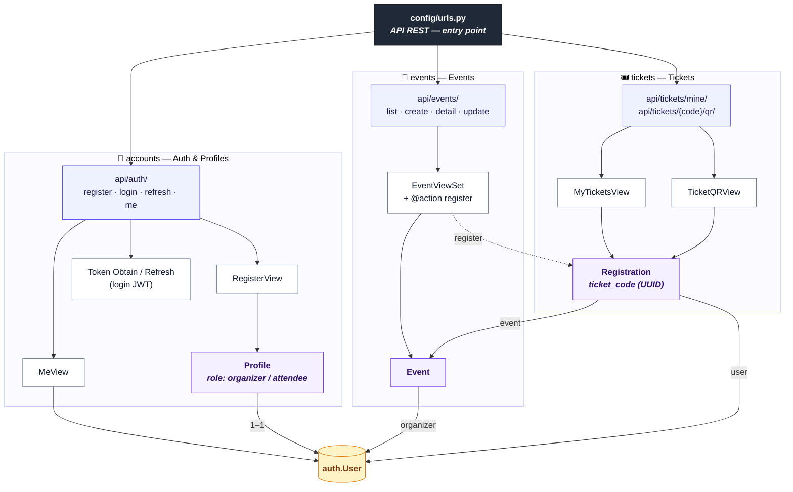

# Shotgun Django

A ticketing platform with a Django REST API backend and a React/Vite frontend.

---

## 🐳 Quick start with Docker (recommended)

The whole stack (PostgreSQL + Django/Gunicorn + React served by Nginx) runs with
a single command. You only need **Docker** and **Docker Compose**.

```bash
# 1. Copy the env
cp .env.example .env

# 2. Build and start everything
docker compose up --build
```

Then open **http://localhost:8080**.

| URL | Service |
|-----|---------|
| http://localhost:8080 | React frontend (Nginx) |
| http://localhost:8080/api/ | Django REST API (proxied) |
| http://localhost:8080/admin/ | Django admin (proxied) |
| http://localhost:8080/api/docs/ | Swagger UI |
| http://localhost:8080/api/redoc/ | ReDoc |
| http://localhost:8080/api/schema/ | OpenAPI schema (JSON/YAML) |

### Architecture

```
                 ┌──────────────────────────────────────────┐
  Browser  ─────▶│  frontend (Nginx :80 → host :8080)         │
                 │   • serves the built React SPA             │
                 │   • /api, /admin, /static → proxy backend  │
                 │   • /media → shared volume                 │
                 └───────────────┬────────────────────────────┘
                                 │ (internal network)
                 ┌───────────────▼────────────────────────────┐
                 │  backend (Django + Gunicorn :8000)          │
                 │   • migrate + collectstatic on startup      │
                 │   • WhiteNoise for /static                  │
                 └───────────────┬────────────────────────────┘
                                 │
                 ┌───────────────▼────────────────────────────┐
                 │  db (PostgreSQL 16, persistent volume)      │
                 └─────────────────────────────────────────────┘
```

### Useful commands

```bash
docker compose up -d --build          # run detached
docker compose logs -f backend        # follow backend logs
docker compose exec backend python manage.py createsuperuser
docker compose exec backend python manage.py seed --flush
docker compose down                   # stop (keeps data volumes)
docker compose down -v                # stop and wipe the database/media volumes
```

Data persists across restarts in the `postgres_data`, `media_volume`, and
`static_volume` Docker volumes.

---

## 🗺️ API URLs & data models

How requests flow from `config/urls.py` through each app's views down to the
models, with the relationships between them.



> **Legend** — blue = URLs · white = DRF views · purple = models · amber = Django `User`.
> Solid arrow = ORM / relation · dotted arrow = custom action.

---

## 📖 API Documentation

Interactive docs are served automatically by the backend:

| URL | Description |
|-----|-------------|
| `/api/docs/` | Swagger UI — browse and test endpoints interactively |
| `/api/redoc/` | ReDoc — clean, readable reference |
| `/api/schema/` | Raw OpenAPI 3 schema (JSON by default, append `?format=yaml` for YAML) |

When running locally the Swagger UI is at **http://localhost:8000/api/docs/**.

---

## Prerequisites (local, without Docker)

- Python 3.10+
- Node.js 18+
- npm

---

## Backend (Django)

```bash
# From the project root
cd backend

# Create and activate a virtual environment
python3 -m venv ../venv
MacOS :
source ../venv/bin/activate
Windows : 
Set-ExecutionPolicy -Scope Process -ExecutionPolicy Bypass -Force; ..\venv\Scripts\Activate.ps1

# Install dependencies
pip install -r requirements.txt

# Apply migrations
python manage.py migrate

# Start the development server (runs on http://localhost:8000)
python manage.py runserver
```

To create a superuser for the Django admin:

```bash
python manage.py createsuperuser
```

---

## Seeding mock data

To populate the database with demo users, events, and registrations:

```bash
# Add demo data
python manage.py seed

# Wipe previously seeded data, then re-seed
python manage.py seed --flush
```

This creates:

- **2 organizers** and **5 attendees** (with the correct roles)
- **6 events** with varied prices, venues, dates, and **cover images** (including one past event)
- **~19 registrations** with mixed statuses (`confirmed`, `pending`, `cancelled`)

All seeded users share the same password: **`password123`**

The command is idempotent (running it again won't create duplicates), and `--flush` only removes the seeded demo data — your superuser is left untouched.

The demo cover images are committed in `backend/events/seed_images/` and copied into
`backend/media/events/` automatically when you run the command, so they display out of
the box. Real user uploads under `media/` stay out of version control.

---

## Frontend (React + Vite)

```bash
# From the project root
cd frontend

# Install dependencies
npm install

# Start the development server (runs on http://localhost:5173)
npm run dev
```

---

## Running both servers

Open two terminal tabs and run each server in parallel:

| Tab | Command |
|-----|---------|
| 1 (backend) | `cd backend && source ../venv/bin/activate && python manage.py runserver` |
| 2 (frontend) | `cd frontend && npm run dev` |

The frontend proxies API requests to the Django backend automatically.
